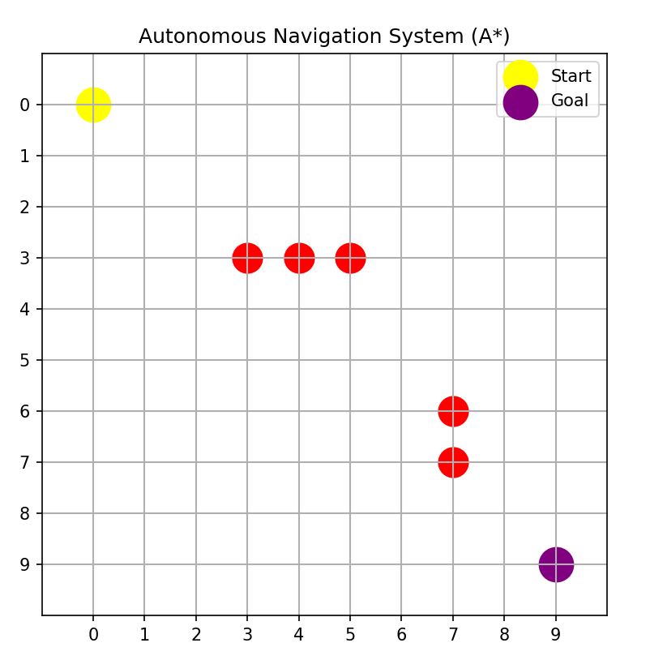
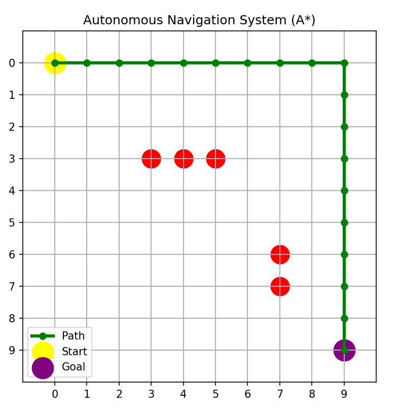
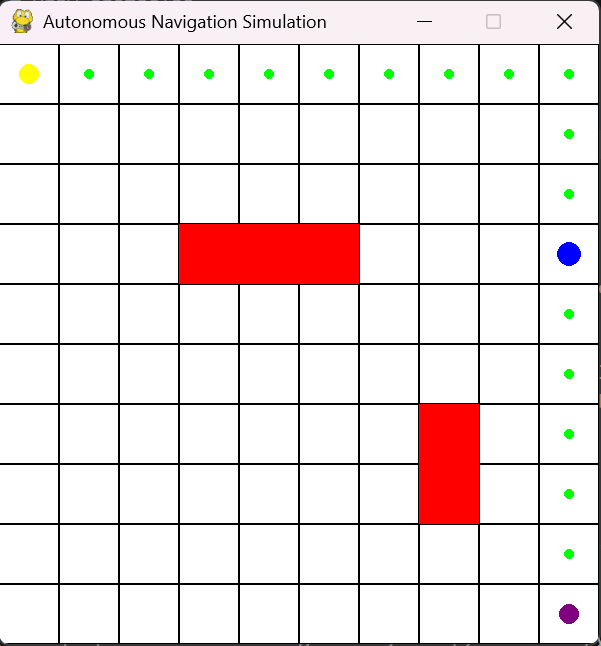

AI-Based Autonomous
 Navigation System

📌 Overview

This project demonstrates an AI-based autonomous navigation system using the A* path planning algorithm. The system enables a robot to navigate from a start position to a goal while avoiding obstacles in a simulated environment.

🎯 Features

- Grid-based environment
- Obstacle detection
- A* path planning algorithm
- Real-time robot simulation using Pygame
- Visualization using Matplotlib

🛠️ Tech Stack

- Python
- NumPy
- Matplotlib
- Pygame

🧠 How It Works

1. Create a grid environment
2. Place obstacles
3. Define start & goal
4. Apply A* algorithm
5. Generate shortest path
6. Simulate robot movement

▶️ How to Run

pip install -r requirements.txt
python main.py

📸 Output Screenshots

🔹 Grid View

🔹 Path Planning

🔹 Simulation

🎥 Demo Video

🚀 Future Improvements

- Real-time object detection (YOLO)
- CARLA simulator integration
- Reinforcement learning

📚 Learning Outcomes

- Path planning algorithms
- Simulation design
- Python project structuring

👨‍💻 Author

Harshal Navale